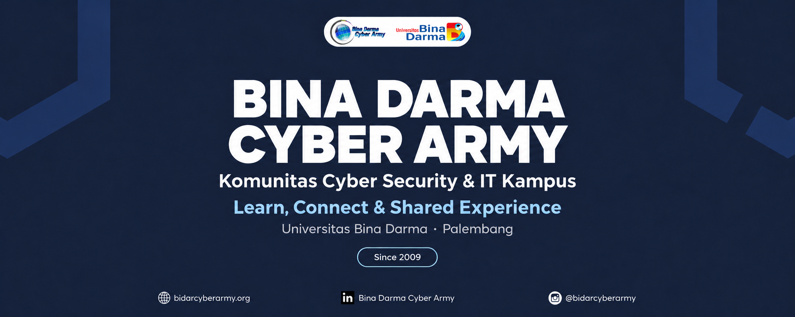
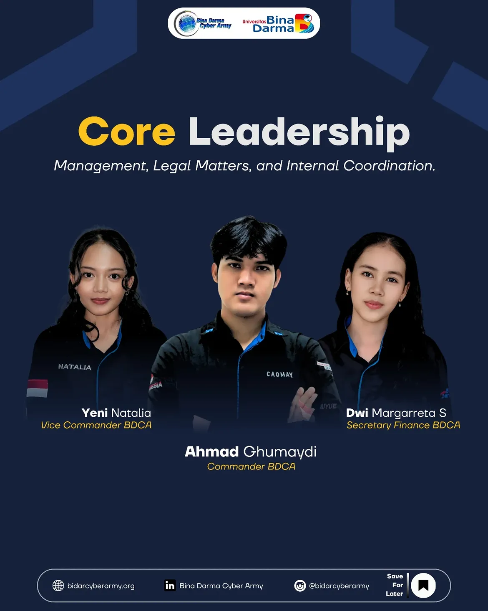
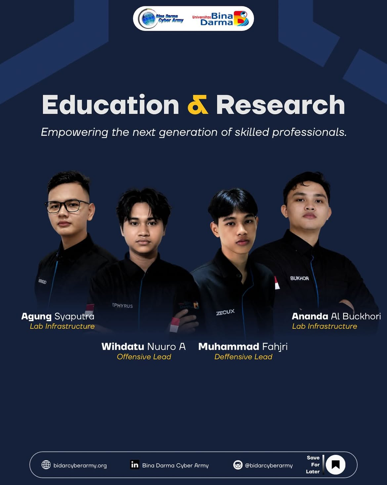
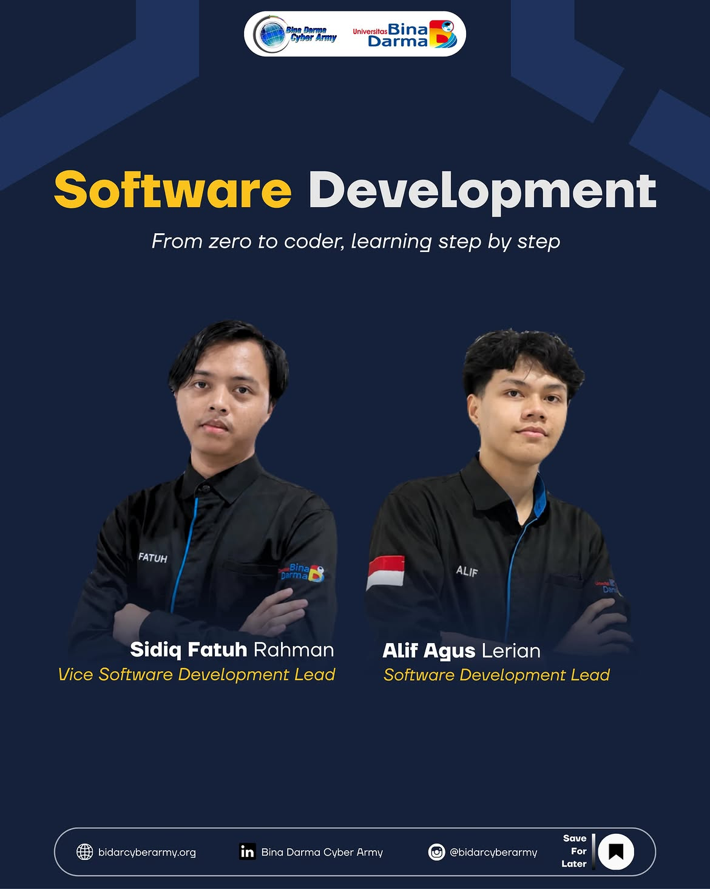
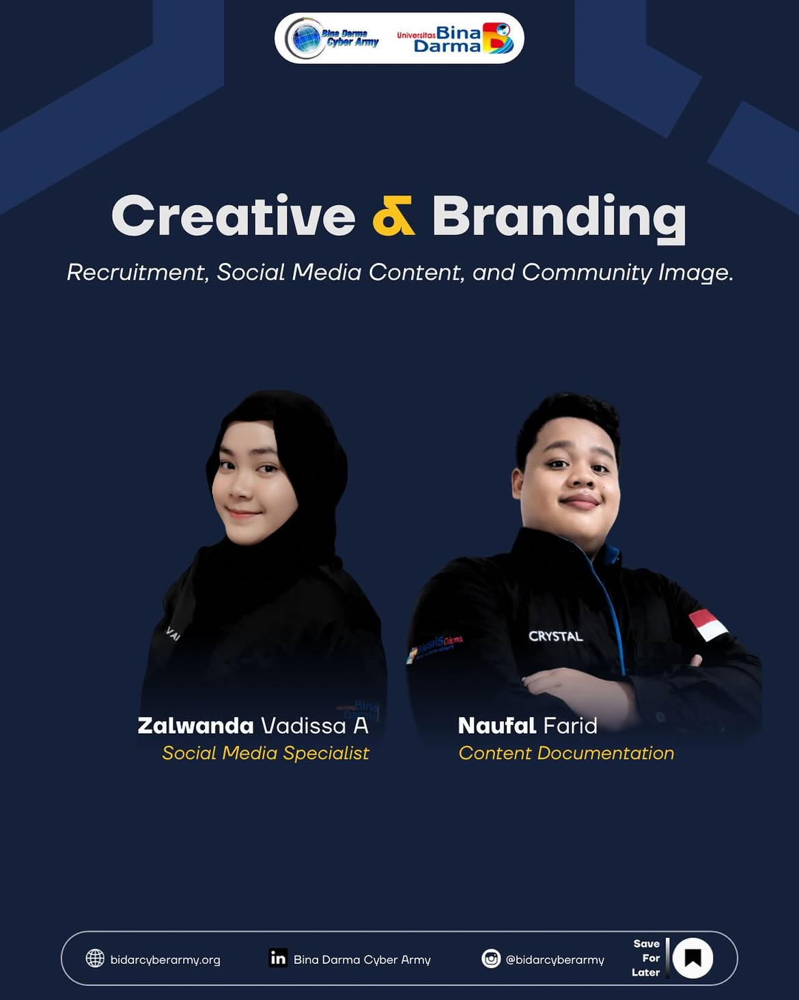
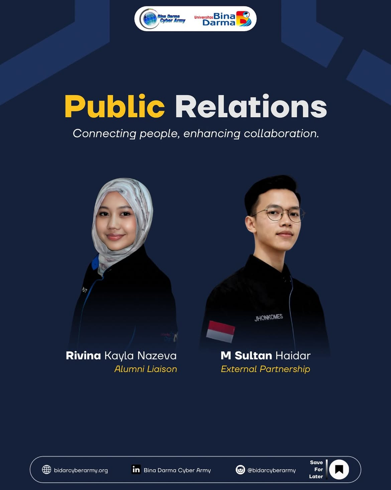

  

  <a href="https://bidarcyberarmy.org">Website</a> ·
  <a href="https://www.instagram.com/bidarcyberarmy/">Instagram</a> ·
  <a href="https://www.linkedin.com/company/bidarcyberarmy/">LinkedIn</a>

<h2 align="center">Selamat datang di Bina Darma Cyber Army 👋</h2>

**Bina Darma Cyber Army (BDCA)** adalah komunitas Cyber Security dan IT di **Universitas Bina Darma, Palembang**, yang berdiri sejak **2009**. Kami menjadi wadah untuk belajar, membangun koneksi, berbagi pengalaman, dan berkarya bersama.

Pada periode **2026/2027**, BDCA dijalankan oleh **13 pengurus inti** yang berfokus pada pengembangan organisasi, pembelajaran, dan persiapan karya baru. Saat ini, keanggotaan terdiri dari tim inti; penerimaan anggota per divisi direncanakan untuk tahap berikutnya.

<h2 align="center">Skill, solusi &amp; pendapatan</h2>

  Kami mengarahkan pengembangan skill menjadi solusi yang bernilai melalui layanan IT dan proyek, mulai dari instalasi software hingga optimalisasi jaringan. Pendapatan dari karya menjadi bagian dari arah pengembangan dan keberlanjutan BDCA.

<strong>Bangkit untuk masa. Masa untuk bangkit.</strong>

<h2 align="center">Struktur organisasi 2026/2027</h2>

13 pengurus inti · 5 tim dan divisi · Satu tujuan bersama

<h3 align="center">Core Leadership</h3>

  

<em>Manajemen organisasi, urusan legal, koordinasi internal, administrasi dan keuangan.</em>

<table align="center" width="100%">
  <tr>
    <td align="center" valign="top">
      <strong>Yeni&nbsp;Natalia</strong> 
      Vice&nbsp;Commander
    </td>
    <td align="center" valign="top">
      <strong>Ahmad&nbsp;Ghumaydi</strong> 
      Commander
    </td>
    <td align="center" valign="top">
      <strong>Dwi&nbsp;Margaretta&nbsp;S</strong> 
      General&nbsp;Secretary&nbsp;&amp;&nbsp;Finance
    </td>
  </tr>
</table>

---

<h3 align="center">Education &amp; Research</h3>

  

<em>Pengembangan kemampuan dan riset keamanan siber: offensive, defensive, lab dan infrastruktur.</em>

<table align="center" width="100%">
  <tr>
    <td align="center" valign="top">
      <strong>Agung&nbsp;Syaputra</strong> 
      Lab&nbsp;&amp;&nbsp;Infrastructure
    </td>
    <td align="center" valign="top">
      <strong>Wihdatu&nbsp;Nuuro&nbsp;Ahmadi</strong> 
      Offensive&nbsp;Lead
    </td>
    <td align="center" valign="top">
      <strong>Muhammad&nbsp;Fahjri</strong> 
      Defensive&nbsp;Lead
    </td>
    <td align="center" valign="top">
      <strong>Ananda&nbsp;Al&nbsp;Buchkori</strong> 
      Lab&nbsp;&amp;&nbsp;Infrastructure
    </td>
  </tr>
</table>

---

<h3 align="center">Software Development</h3>

  

<em>Rancang bangun perangkat lunak dan sistem untuk mendukung infrastruktur keamanan siber.</em>

<table align="center" width="100%">
  <tr>
    <td align="center" valign="top">
      <strong>Sidiq&nbsp;Fatuh&nbsp;Rahman</strong> 
      Vice&nbsp;Software&nbsp;Development&nbsp;Lead
    </td>
    <td align="center" valign="top">
      <strong>Alif&nbsp;Agus&nbsp;Lerian</strong> 
      Software&nbsp;Development&nbsp;Lead
    </td>
  </tr>
</table>

---

<h3 align="center">Creative &amp; Branding</h3>

  

<em>Konten, desain, dokumentasi, dan citra komunitas di media digital.</em>

<table align="center" width="100%">
  <tr>
    <td align="center" valign="top">
      <strong>Zalwanda&nbsp;Vadissa&nbsp;Arla</strong> 
      Social&nbsp;Media&nbsp;Specialist
    </td>
    <td align="center" valign="top">
      <strong>Naufal&nbsp;Farid</strong> 
      Content&nbsp;Designer&nbsp;&amp;&nbsp;Documentation
    </td>
  </tr>
</table>

---

<h3 align="center">Public Relations</h3>

  

<em>Komunikasi dengan alumni dan kerja sama dengan pihak eksternal.</em>

<table align="center" width="100%">
  <tr>
    <td align="center" valign="top">
      <strong>Rivina&nbsp;Kayla&nbsp;Nazeva</strong> 
      Alumni&nbsp;Liaison
    </td>
    <td align="center" valign="top">
      <strong>M.&nbsp;Sultan&nbsp;Haidar</strong> 
      External&nbsp;Partnership
    </td>
  </tr>
</table>

---

<h2 align="center">Proyek &amp; karya</h2>

Profil GitHub BDCA sedang ditata untuk menjadi tempat publikasi karya baru. Proyek akan ditambahkan di sini saat tersedia untuk publik, beserta dokumentasi dan tautan repositorinya.

<h2 align="center">Penerimaan anggota</h2>

**Penerimaan anggota belum dibuka.** BDCA berencana membuka penerimaan anggota melalui divisi yang ada pada tahap berikutnya. Informasi pembukaan dan mekanismenya akan diumumkan melalui kanal resmi BDCA.

<h2 align="center">Terhubung dengan BDCA</h2>

Ikuti kabar komunitas, kegiatan, dan pengumuman melalui [Instagram @bidarcyberarmy](https://www.instagram.com/bidarcyberarmy/). Kunjungi juga [website BDCA](https://bidarcyberarmy.org) dan [LinkedIn Bina Darma Cyber Army](https://www.linkedin.com/company/bidarcyberarmy/).

---

  <strong>Bina Darma Cyber Army</strong> 
  Universitas Bina Darma · Palembang · Indonesia 
  Sejak 2009

